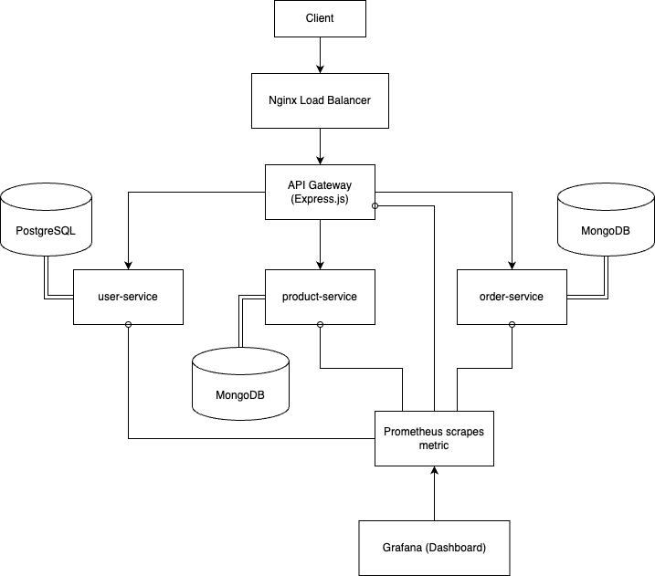

# Cloud-Native Microservice Application with Custom API Gateway


This project demonstrates a cloud-native microservice architecture featuring a custom-built API Gateway (Node.js/Express.js), Nginx for load balancing, JWT-based security, and Prometheus/Grafana for monitoring. The system is fully containerized using Docker and Docker Compose.

## Core Components & Features

*   **Custom API Gateway (Node.js/Express.js):**
    *   Centralized request routing, JWT authentication, rate limiting, and CORS.
*   **Nginx Reverse Proxy/Load Balancer:**
    *   System entry point, distributes load to API Gateway instances.
*   **Microservices (Node.js/Express.js):**
    *   `user-service`: User management & authentication (PostgreSQL).
    *   `product-service`: Product catalog management (MongoDB).
    *   `order-service`: Order processing (MongoDB).
*   **Database per Service Principle:** Ensures data isolation and independent scalability.
*   **Containerization:** Docker & Docker Compose for consistent environments and orchestration.
*   **Monitoring:** Prometheus for metrics collection, Grafana for visualization.

## Technology Stack

*   **Backend & API Gateway:** Node.js, Express.js
*   **Load Balancer:** Nginx
*   **Databases:** PostgreSQL, MongoDB
*   **Authentication:** JSON Web Tokens (JWT)
*   **Containerization:** Docker, Docker Compose
*   **Monitoring:** Prometheus, Grafana

## System Architecture Overview

Client requests are routed through Nginx to a custom API Gateway. The Gateway handles authentication and other cross-cutting concerns before forwarding requests to the appropriate backend microservice. Each service has its dedicated database. Prometheus scrapes metrics, visualized in Grafana.




## Prerequisites

*   Docker Desktop (with Docker Engine and Docker Compose) installed.
*   Git.

## Getting Started

1.  **Clone the repository:**
    ```bash
    git clone https://github.com/your-username/api-gateway-project.git
    cd api-gateway-project
    ```

2.  **Environment Configuration:**
    *   Create a `.env` file in the `user-service/` directory. Example:
        ```env
        # user-service/.env
        DB_HOST=user-db
        DB_NAME=app_user_db
        DB_USER=appuser
        DB_PASSWORD=apppassword
        JWT_SECRET=your_strong_jwt_secret_for_user_service # Ensure this is secure
        PORT=3001
        ```
    *   Ensure the `jwtSecret` in `api-gateway/config/gateway.config.json` is securely set and consistent with how tokens are managed/verified.
    *   Review and adjust database credentials or ports in `docker-compose.yml` if necessary.

3.  **Build and Run with Docker Compose:**
    ```bash
    docker-compose up --build -d
    ```
    *(The `-d` flag runs containers in detached mode.)*

4.  **Accessing Endpoints:**
    *   **API Gateway (via Nginx):** `http://localhost:8080`
        *   *Example Health Check (if configured):* `GET http://localhost:8080/api/health`
    *   **Grafana Dashboard:** `http://localhost:3000` (Default: admin/admin)
    *   **Prometheus UI:** `http://localhost:9090`

5.  **Example API Interactions (via API Gateway):**
    *   Register User: `POST http://localhost:8080/users/register`
        ```json
        { "username": "testuser", "email": "test@example.com", "password": "securePassword123" }
        ```
    *   Login: `POST http://localhost:8080/users/login`
        ```json
        { "email": "test@example.com", "password": "securePassword123" }
        ```
    *   Get Products (Requires JWT): `GET http://localhost:8080/products` (Include JWT in `Authorization: Bearer <token>` header)

6.  **Viewing Container Logs:**
    ```bash
    # View logs for a specific service
    docker-compose logs -f api-gateway

    # View logs for all services
    docker-compose logs -f
    ```

7.  **Stopping the Application:**
    ```bash
    docker-compose down
    ```
    *(This stops and removes containers, networks, and optionally volumes if specified.)*

## Project Structure
```
.
├── api-gateway/ # Custom Express.js API Gateway
│ ├── config/ # Gateway and route configurations
│ └── middleware/ # Custom middleware (auth, rate limiting, etc.)
├── user-service/ # User management microservice
├── product-service/ # Product catalog microservice
├── order-service/ # Order processing microservice
├── monitoring/ # Prometheus and Grafana configurations
├── docker-compose.yml # Docker Compose orchestration file
├── nginx.conf # Nginx configuration for load balancing
└── README.md
```